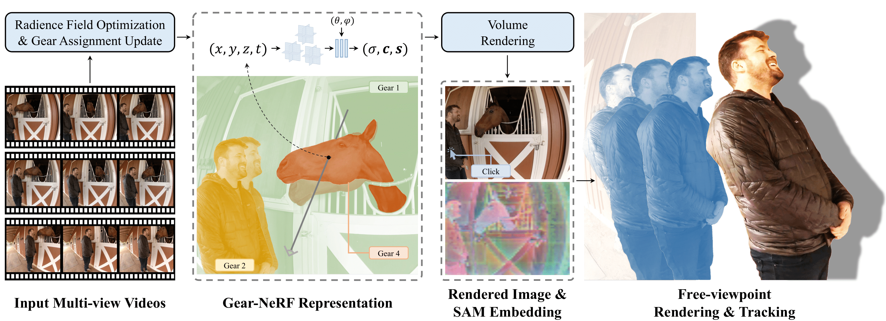

<!--
Copyright (C) 2024 Mitsubishi Electric Research Laboratories (MERL)

SPDX-License-Identifier: AGPL-3.0-or-later
-->

# Gear-NeRF (CVPR 2024)

This repository contains the implementation of the paper:
> **Gear-NeRF: Free-Viewpoint Rendering and Tracking with Motion-aware Spatio-Temporal Sampling"**<br>
> [Xinhang Liu](http://xinhangliu.com/), [Yu-Wing Tai](https://yuwingtai.github.io/), [Chi-Keung Tang](https://cse.hkust.edu.hk/admin/people/faculty/profile/cktang), [Pedro Miraldo](https://pmiraldo.github.io/), [Suhas Lohit](https://www.merl.com/people/slohit), [Moitreya Chatterjee](https://sites.google.com/site/metrosmiles/)

IEEE/CVF Conference on Computer Vision and Pattern Recognition (**CVPR**), 2024 (Highlight)


## [Website](https://merl.com/research/highlights/gear-nerf) |  [Paper](https://www.merl.com/publications/docs/TR2024-042.pdf) | [Video](https://www.youtube.com/watch?v=3Pg92mfENds)

## Summary

To make free viewpoint rendering systems ubiquitous, it is essential that they be capable of handling dynamic scenes, i.e. those where objects change in their position or configuration or both over time. Existing approaches for this task, propose pipelines that are agnostic to the semantic content of the scene and thus treat every region in the 3D space, as being equally important, when rendering. This results in the system struggling to render the regions of the scene that have high motion. In this paper, we depart from such a simplistic rendering pipeline by adjusting the spatio-temporal sampling resolution of the different semantic regions of the scene, based on the extent of their motion. These regions are grouped based on this criterion and each such region is called a "Gear". We propose to sample more densely from regions with high motion, i.e. those that are assigned higher gears. This results in noticeable improvement in rendering quality over the state-of-the-art approaches, across a wide variety of dynamic scenes. Furthermore, almost for free, our proposed method enables free-viewpoint tracking of objects of interest starting from a single mouse click - a functionality not yet achieved by prior methods.




## Table of contents
-----
  * [Installation](#Installation)
  * [Dynamic Datasets](#dynamic-datasets)
  * [Running the Code on Dynamic Scenes](#running-the-code-on-dynamic-scenes)
  * [Acknowledgements](#Acknowledgements)
  * [Citation](#Citation)
  * [License](#License)
------


# Installation

To install all required python dependences run

```
conda env create -f environment.yml
conda activate gearnerf
sh Install.sh
```

Download the [SAM-HQ checkpoint](https://drive.google.com/file/d/1qobFYrI4eyIANfBSmYcGuWRaSIXfMOQ8/view?usp=sharing) and put it in the `~/pre_trained` folder.

Note that we tested the Gear-NeRF codebase on a machine running Ubuntu 22.04, with an NVIDIA 3090 RTX GPU, CUDA version 11.6, and 128 GB of RAM.


# Dynamic Datasets

By default, we assume that:

1. All datasets are located in the `~/data` folder (specified by the `experiment.params.data_dir` argument) E.g. data/immersive/05_Horse/camera_0001.mp4
2. With the subdirectory for each individual dataset specified by the `experiment.dataset.data_subdir` argument (e.g., see `conf/experiment/params/local.yaml` and `conf/experiment/dataset/technicolor.yaml`).


## Google Immersive

Download the Google Immersive sequences from their [release page](https://github.com/augmentedperception/deepview_video_dataset). As an example, in order to download the flames sequence, run:

```
wget https://storage.googleapis.com/deepview_video_raw_data/02_Flames.zip
```
Then extract the sequence to the `~/data` folder as stated above.

## Example: Running the Code on the Horse Scene

By default...

1. Checkpoints are written to the `~/checkpoints` folder (specified by the `experiment.params.ckpt_dir` argument)
2. Logs are written to the `~/logs` folder (specified bt the `experiment.params.log_dir` argument).

In order to train Gear-NeRF on the Horse scene from the Google Immersive dataset, run:

```
sh scripts/train_horse.sh <gpu_to_use>
```

After training, you should see the rendered RGB image as well as SAM feature maps with visualization. These feature maps can be turned into segmentation masks according to various user inputs.

To render a video of RGB and SAM feature maps with an automatically generated camera trajectory, run:

```
sh scripts/render_horse.sh <gpu_to_use>
```

To render with a given camera pose and time step specified in scripts/input_pose.json, run:
```
sh scripts/render_horse_given_pose.sh <gpu_to_use>
```

## Tracking

In order to track a region in novel views, run the following command:

```
python demo_tracking.py
```
One needs to provide the coordinates of where the user would have clicked on a given frame in Line 108 of demo_tracking.py.

## Contributing

See [CONTRIBUTING.md](CONTRIBUTING.md) for our policy on contributions.

## Acknowledgements

The code of Gear-NeRF is inspired from: [HyperReel](https://github.com/facebookresearch/hyperreel), which in turn has been inspired from:  [nerf_pl](https://github.com/kwea123/nerf_pl), [TensoRF](https://github.com/apchenstu/TensoRF), [torch-ngp](https://github.com/ashawkey/torch-ngp). We are also grateful to authors of the following repositories: [SAM](https://github.com/facebookresearch/segment-anything), and [SAM-HQ](https://github.com/SysCV/sam-hq)

## Citation

```
@inproceedings{liu2024gear,
  title={Gear-NeRF: Free-Viewpoint Rendering and Tracking with Motion-aware Spatio-Temporal Sampling},
  author={Liu, Xinhang and Tai, Yu-Wing and Tang, Chi-Keung and Miraldo, Pedro and Lohit, Suhas and Chatterjee, Moitreya},
  booktitle={Proceedings of the IEEE/CVF Conference on Computer Vision and Pattern Recognition},
  pages={19667--19679},
  year={2024}
}
```

## License

Released under `AGPL-3.0-or-later` license, as found in the [LICENSE.md](LICENSE.md) file.

All files, except as noted below:
```
Copyright (c) 2024 Mitsubishi Electric Research Laboratories (MERL)
SPDX-License-Identifier: AGPL-3.0-or-later
```

The files under the folders:

* `~/datasets/`
* `~/scripts/`

were taken without modification from [here](https://github.com/facebookresearch/hyperreel/tree/main) (license included in [LICENSES/MIT.txt](LICENSES/MIT.txt)), with the following copyrights:
```
Copyright (c) Meta Platforms, Inc. and affiliates.
```

The files under the folder:

* `~/utils/`

were taken without modification from [here](https://github.com/facebookresearch/hyperreel/tree/main) (license included in [LICENSES/MIT.txt](LICENSES/MIT.txt)), with the following copyrights:
```
Copyright (c) Meta Platforms, Inc. and affiliates.
Copyright (c) 2022 hawkey
```

except the following files:

* `~/utils/sh_utils.py`
* `~/utils/tensorf_utils.py`

which were also taken without modification from [here](https://github.com/facebookresearch/hyperreel/tree/main) (license included in [LICENSES/MIT.txt](LICENSES/MIT.txt)), with the following copyrights:
```
Copyright (c) Meta Platforms, Inc. and affiliates.
Copyright (c) 2022 Anpei Chen
```

The files under the folder:

* `~/conf/`

were taken without modification from [here](https://github.com/facebookresearch/hyperreel/tree/main) (license included in [LICENSES/MIT.txt](LICENSES/MIT.txt)), with the following copyrights:
```
Copyright (c) Meta Platforms, Inc. and affiliates.
Copyright (c) 2020 Quei-An Chen
```

The files under the folder:

* `~/nlf/embedding`
* `~/nlf/intersect`
* `~/nlf/models`
* `~/nlf/regularizers`
* `~/nlf/visualizers`

were taken without modification from [here](https://github.com/facebookresearch/hyperreel/tree/main) (license included in [LICENSES/MIT.txt](LICENSES/MIT.txt)), with the following copyrights:
```
Copyright (c) Meta Platforms, Inc. and affiliates.
```

The files under the folder:

* `~/nlf/conf/`

were taken without modification from [here](https://github.com/facebookresearch/hyperreel/tree/main) (license included in [LICENSES/MIT.txt](LICENSES/MIT.txt)), with the following copyrights:
```
Copyright (c) Meta Platforms, Inc. and affiliates.
Copyright (c) 2020 Quei-An Chen
```

The following files:

* `~/nlf/nets/array_nd.py`
* `~/nlf/nets/__init__.py`
* `~/nlf/nets/mlp.py`
* `~/nlf/nets/nets.py`
* `~/nlf/nets/siren.py`
* `~/nlf/nets/tensorf.py`
* `~/nlf/nets/tensorf_density.py`
* `~/nlf/nets/tensorf_hybrid.py`
* `~/nlf/nets/tensorf_no_sample.py`
* `~/nlf/nets/tensorf_reflect.py`

were taken without modification from [here](https://github.com/facebookresearch/hyperreel/tree/main) (license included in [LICENSES/MIT.txt](LICENSES/MIT.txt)), with the following copyrights:
```
Copyright (c) Meta Platforms, Inc. and affiliates.
Copyright (c) 2022 Anpei Chen
```

The following files:

* `~/nlf/activations.py`
* `~/nlf/contract.py`
* `~/nlf/param.py`
* `~/nlf/pe.py`
* `~/nlf/rendering.py`
* `~/nlf/subdivision.py`

were taken without modification from [here](https://github.com/facebookresearch/hyperreel/tree/main) (license included in [LICENSES/MIT.txt](LICENSES/MIT.txt)), with the following copyrights:
```
Copyright (c) Meta Platforms, Inc. and affiliates.
```

The following files:

* `~/nlf/__init__.py`
* `~/losses.py`
* `~/main.py`
* `~/metrics.py`
* `~/environment.yml`

were adapted from [here](https://github.com/facebookresearch/hyperreel/tree/main) (license included in [LICENSES/MIT.txt](LICENSES/MIT.txt)), with the following copyrights:
```
# Copyright (c) 2024 Mitsubishi Electric Research Laboratories (MERL)
# Copyright (c) Meta Platforms, Inc. and affiliates.
```
